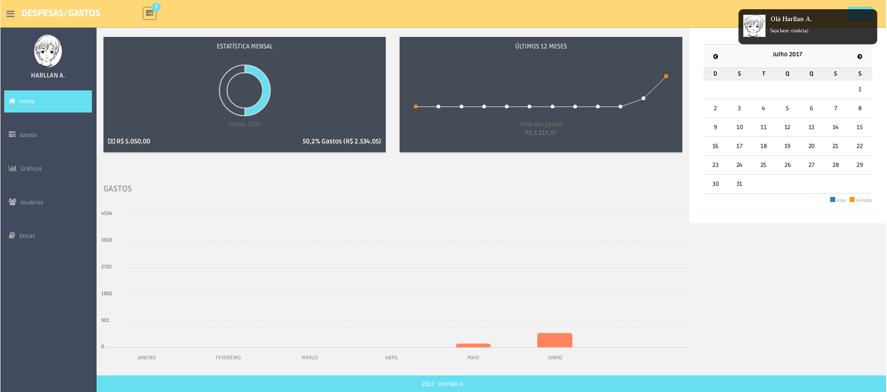
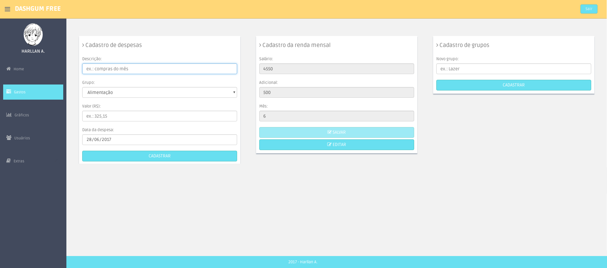
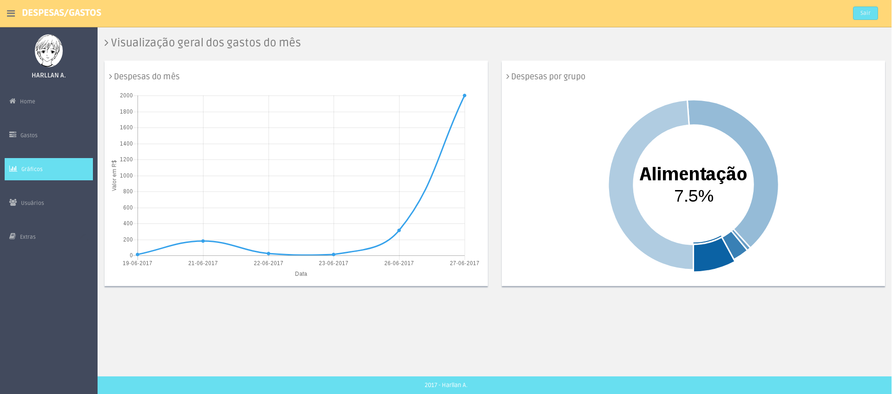
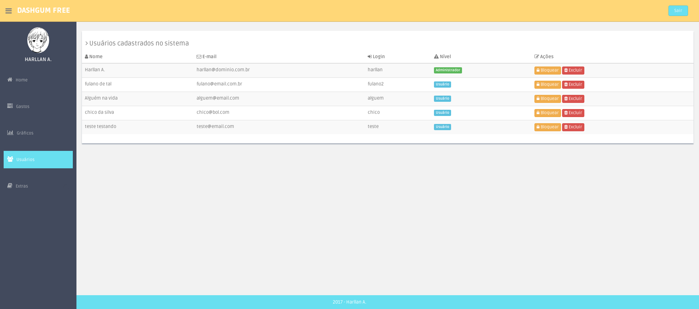
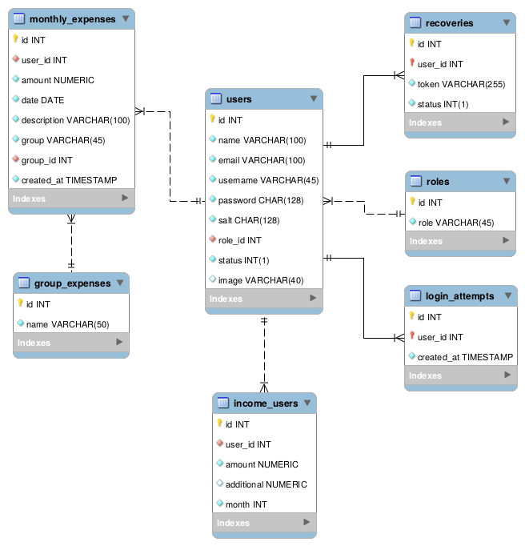

# MyProject_Expenses

Esse projeto (na pasta myExpenses) é um sistema web no qual o usuário poderá colocar as suas despesas e seus gastos mensais.

Uso de: 
* HTML, CSS, JavaScript, PHP e MySQL.
* Mini-framework PHP: [HXPHP Framework](http://www.hxphp.com.br/).
* Template bootstrap: [DashGum - Free Dashboard](http://blacktie.co/2014/07/dashgum-free-dashboard/).

## Páginas da aplicação Web

### Home

Mostra algumas informações a respeito das despesas do usuário, como: quantos porcento foram gastos da sua renda do mês atual, gastos dos últimos 6 e 12 meses.



### Gastos

Aqui são feitos os cadastros das despesas, renda mensal e grupos. Esses grupos são em relação as depesas/gastos, por exemplo: alimentação, saúde, transporte ...



### Gráficos

Nesta página o usuário pode vizualizar as despesas/gastos por meio de gráficos. Na esquerda o gráfico ilustra as despesas do mês atual e na direita são as despesas por grupo.



### Usuários

Essa página só está disponível para o usuário com nível administrador, pois só ele poderá bloquear/excluir algum usuário do sistema.




## Para utilizar a aplicação é necessário:

**Requisitos**
- PHP 5.4+
- MySql 5.5+
- Apache
- Composer

Para o PHP, MySQL e Apache você pode utilizar o [XAMPP](https://www.apachefriends.org/download.html) (para Windows, Linux e Mac) ou algum outro de sua preferência.

O framework HXPHP utiliza o [Composer](https://getcomposer.org/download) para gerenciar as dependências. Certifique-se que o mesmo está instalado em sua máquina e para isso, abra o terminal e digite o seguinte comando: `composer --version`.

Após constatar que o Composer está instalado e funcionando, navegue até a pasta do framework e execute o comando: `composer install`.

:heavy_exclamation_mark: Atenção :heavy_exclamation_mark: O "*mod_rewrite*" deve estar habilitado, caso contrário o MVC não terá efeito e o Apache irá reportar o erro **"Not Found"**. [(ref)](https://github.com/brunosantoshx/hxphp-docs/blob/master/01-essential-information.md)


### Banco de Dados (BD)

Na pasta **data** há o script sql para criar as tabelas no banco de dados. Para criar o BD use: `CREATE DATABASE nomeDoBanco;`.
Na figura abaixo temos o diagrama ER do banco.



No código fonte da aplicação deve-se alterar o arquivo `/app/config.php` com os dados do BD. Exemplo de configuração:

```php
$configs->env->development->database->setConnectionData(array(
    'driver' => 'mysql',
    'host' => 'localhost',
    'user' => 'root',
    'password' => '123',
    'dbname' => 'myDataBase'
  ));
```

## Licença

[](https://creativecommons.org/licenses/by-nc-sa/4.0/)

MIT License

Copyright (c) 2017 [Harllan Andryê](https://github.com/HarllanAndrye)

